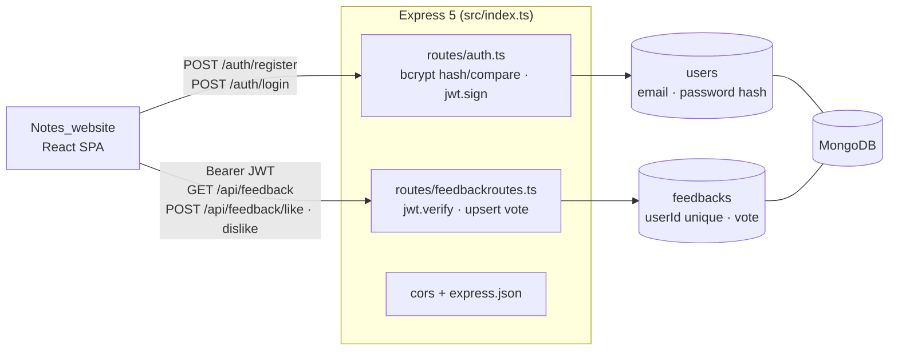

# Notes Backend

**REST API for the [Notes website](https://github.com/nakultt/Notes_website): email/password auth with JWT and a one-vote-per-user like/dislike feedback counter.**

Built with Express 5, TypeScript and MongoDB (Mongoose), and deployed on Render. The React frontend calls it to sign users in and to record site feedback.

---

## Architecture



- **Auth:** passwords are hashed with bcrypt (10 rounds). Login returns a JWT that carries `userId` and `email`.
- **Feedback:** each user has exactly one `Feedback` document, with a unique `userId` and a vote of `like`, `dislike` or `null`. Voting is an upsert, so switching from like to dislike replaces the old vote, and every response returns the current global totals together with the caller's own vote.

## API

| Method | Path | Auth | Body | Response |
|---|---|---|---|---|
| `POST` | `/auth/register` | — | `{ email, password }` | `201` on success, `400` if the user exists |
| `POST` | `/auth/login` | — | `{ email, password }` | `{ token, email }` |
| `GET` | `/api/feedback` | Bearer | — | `{ likes, dislikes, userVote }` |
| `POST` | `/api/feedback/like` | Bearer | — | `{ likes, dislikes, userVote: "like" }` |
| `POST` | `/api/feedback/dislike` | Bearer | — | `{ likes, dislikes, userVote: "dislike" }` |

## Getting started

```bash
npm install
cat > .env <<EOF2
PORT=5000
MONGO_URI=mongodb://localhost:27017/notes
JWT_SECRET=change-me
EOF2
npm run dev          # ts-node, hot path
# or
npm run build && npm start
```


## Project structure

```
src/
├── index.ts               # app bootstrap, middleware, router mounting
├── config/database.ts     # Mongoose connection
├── models/users.ts        # User schema
├── models/feedback.ts     # Feedback schema
└── routes/
    ├── auth.ts            # /auth/register, /auth/login
    └── feedbackroutes.ts  # /api/feedback*
```

## Tech stack

Node.js · Express 5 · TypeScript · MongoDB / Mongoose · bcrypt · jsonwebtoken · CORS · dotenv · Render
